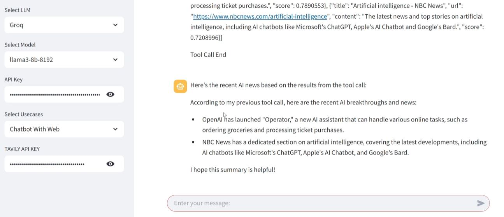

# Agentic AI Chatbot with Web Search

An end-to-end AI chatbot application built with LangGraph and Streamlit that supports both basic conversation and web-enhanced responses using Tavily search integration.



## 🚀 Features

- **Dual Chatbot Modes**: 
  - Basic Chatbot for standard conversations
  - Web-Enhanced Chatbot with real-time search capabilities
- **Modern Architecture**: Built with LangGraph for graph-based conversation flows
- **Multiple LLM Support**: Configurable with Groq and OpenAI models
- **Interactive UI**: Clean Streamlit interface for seamless user experience
- **Tool Integration**: Tavily search tool for up-to-date information retrieval
- **Modular Design**: Well-structured codebase with separate nodes, tools, and state management

## 🛠️ Technology Stack

- **Framework**: LangGraph for conversation flow management
- **UI**: Streamlit for web interface
- **LLM Integration**: LangChain with Groq and OpenAI support
- **Search Tool**: Tavily API for web search functionality
- **Vector Store**: FAISS for efficient similarity search
- **Architecture**: Event-driven graph-based chatbot system

## 📁 Project Structure

```
├── app.py                    # Main application entry point
├── requirements.txt          # Python dependencies
├── WORKFLOW_DIAGRAM.md      # Detailed technical workflow
├── src/
│   └── langgraphagenticai/
│       ├── main.py          # Core application logic
│       ├── LLMS/
│       │   └── groqllm.py   # Groq LLM configuration
│       ├── graph/
│       │   └── graph_builder.py  # Graph construction logic
│       ├── nodes/
│       │   ├── basic_chatbot_node.py      # Basic chat functionality
│       │   └── chatbot_with_Tool_node.py  # Web-enhanced chat
│       ├── state/
│       │   └── state.py     # Conversation state management
│       ├── tools/
│       │   └── search_tool.py  # Tavily search integration
│       └── ui/
│           ├── uiconfigfile.py    # UI configuration
│           └── streamlitui/
│               ├── loadui.py      # UI loading logic
│               └── display_result.py  # Result display
```

## 🎯 Use Cases

1. **Basic Chatbot**: Standard conversational AI for general queries
2. **Web-Enhanced Chatbot**: AI assistant with real-time web search for current information

## 🔧 Installation & Setup

1. Clone the repository
2. Install dependencies:
   ```bash
   pip install -r requirements.txt
   ```
3. Run the application:
   ```bash
   python app.py
   ```

## 💡 Key Components

- **GraphBuilder**: Orchestrates different chatbot configurations
- **State Management**: Handles conversation context and flow
- **Tool Integration**: Seamlessly incorporates web search capabilities
- **UI Components**: Modular Streamlit interface for configuration and chat

## 🔄 How It Works

```
┌─────────────────────────────────────────────────────────────────────────┐
│                          USER INTERACTION                               │
└─────────────────────────────────────────────────────────────────────────┘
                                    │
                                    ▼
┌────────────────────────────────────────────────────────────────────────┐
│  STEP 1: Choose Your Setup                                             │
│  ┌─────────────────┐  ┌─────────────────┐  ┌───────────────────────┐   │
│  │  Pick AI Model  │  │  Choose Usecase │  │  Enter Tavily API Key │   │
│  │  • Groq         │  │  • Basic Chat   │  │  • Required           │   │
│  │  • OpenAI       │  │  • Web Search   │  │  • Secure             │   │
│  └─────────────────┘  └─────────────────┘  └───────────────────────┘   │
└────────────────────────────────────────────────────────────────────────┘
                                    │
                                    ▼
┌────────────────────────────────────────────────────────────────────────┐
│  STEP 2: Type Your Message                                             │
│  ┌─────────────────────────────────────────────────────────────────┐   │
│  │  "What's the weather like today?"                               │   │
│  │  "Explain quantum computing"                                    │   │
│  │  "Latest news about AI"                                         │   │
│  └─────────────────────────────────────────────────────────────────┘   │
└────────────────────────────────────────────────────────────────────────┘
                                    │
                                    ▼
┌────────────────────────────────────────────────────────────────────────┐
│  STEP 3: AI Processing                                                 │
│                                                                        │
│  ┌─────────────────────────────┐   ┌─────────────────────────────┐     │
│  │      BASIC CHAT MODE        │   │    WEB SEARCH MODE          │     │
│  │                             │   │                             │     │
│  │  AI reads your message      │   │  AI reads your message      │     │
│  │         ↓                   │   │         ↓                   │     │
│  │  Generates response         │   │  Decides if web search      │     │
│  │         ↓                   │   │  is needed                  │     │
│  │  Shows answer               │   │         ↓                   │     │
│  │                             │   │  Searches internet          │     │
│  │                             │   │         ↓                   │     │
│  │                             │   │  Combines search results    │     │
│  │                             │   │  with AI knowledge          │     │
│  │                             │   │         ↓                   │     │
│  │                             │   │  Shows comprehensive answer │     │
│  └─────────────────────────────┘   └─────────────────────────────┘     │
└────────────────────────────────────────────────────────────────────────┘
                                    │
                                    ▼
┌────────────────────────────────────────────────────────────────────────┐
│  STEP 4: Get Your Answer                                               │
│  ┌─────────────────────────────────────────────────────────────────┐   │
│  │  💬 Your message appears in the chat                            │   │
│  │  🤖 AI response appears below                                   │   │
│  │  🔍 (Web mode) Search results shown if used                     │   │
│  │  📝 Clear, formatted answers                                    │   │
│  └─────────────────────────────────────────────────────────────────┘    │
└─────────────────────────────────────────────────────────────────────────┘
```

## 🌟 Highlights

This project demonstrates:
- **AI Integration**: Modern LLM frameworks and graph-based architectures
- **Full-Stack Development**: Backend logic with frontend UI implementation
- **API Integration**: External tool integration for enhanced functionality
- **Clean Architecture**: Modular, maintainable code structure
- **User Experience**: Intuitive interface with multiple interaction modes
